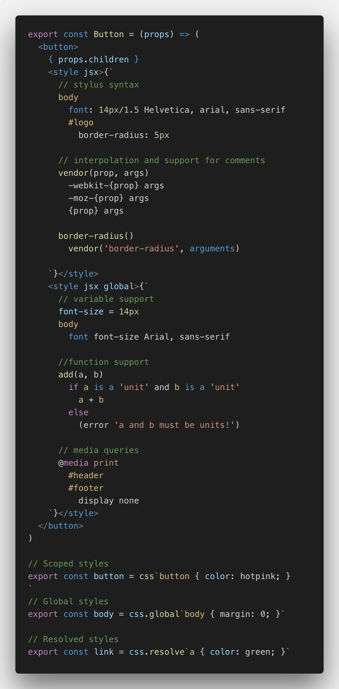

# vscode-styled-jsx-stylus

Stylus syntax highlighting for [styled-jsx](https://github.com/zeit/styled-jsx) in VS Code.

This project is a fork from <https://github.com/iFwu/vscode-styled-jsx> to support stylus syntax in styled-jsx.

It uses the CSS grammar from [matthojo/language-stylus: Syntax highlighting and snippets to Stylus files in Atom.](https://github.com/matthojo/language-stylus)

